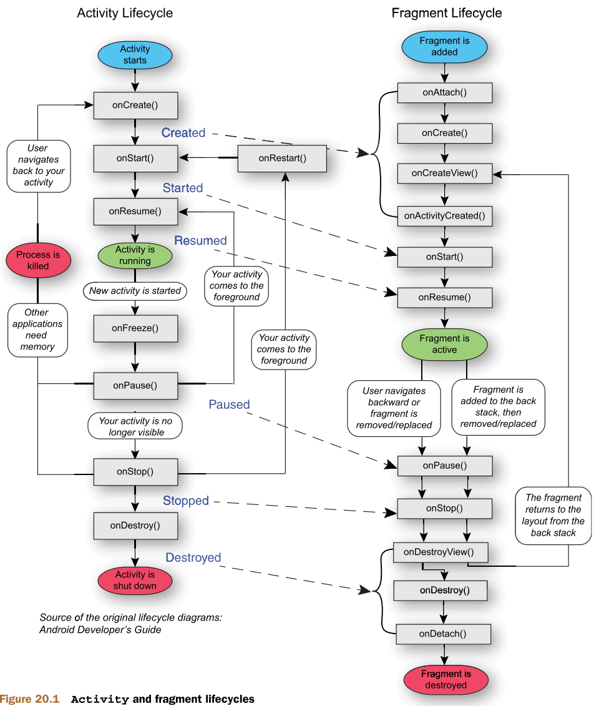
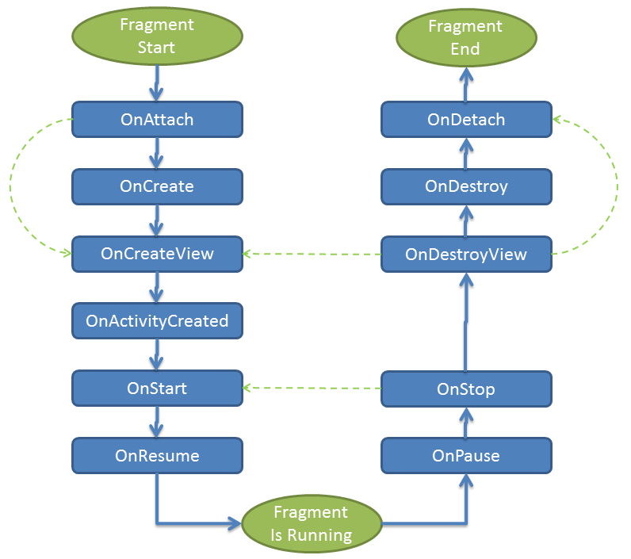

## **Fragment**: 
1. After API 11
2. They are smaller UI components that work with in the activity
3.  More dynamic
4. Can create as many as fragment in an activity and onr fragment can be used in many activities

## **Fragment Lifecycle**:





## Creating a Fragment:
1. Create a new `Layout Resource File`  and design it as per need.
2. Create a class which extends to `Fragment` class and generate `onCreateView()` method.
```java
public class MyFragment extends Fragment {  
    @Nullable  
    @Override    public View onCreateView(@NonNull LayoutInflater inflater, @Nullable ViewGroup container, @Nullable Bundle savedInstanceState) {  
        return inflater.inflate(R.layout.my_fragment, container, false);  
    }  
}
```
3. Add a `FragmentContainerView` in a activity and specify the above created fragment.